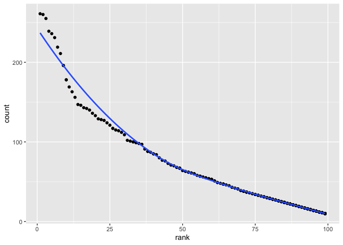

p8105\_hw2\_wx2233
================
Weijia Xiong
9/24/2019

## Problem 1

### Mr. Trash Wheel

``` r
Wheel_data = 
 readxl::read_excel("./data/Trash-Wheel-Collection-Totals-8-6-19.xlsx",sheet = "Mr. Trash Wheel", range = "A2:N338") %>%  #import data from sheet 1
  janitor::clean_names() %>%  #use reasonable variable names
  drop_na(dumpster) %>% #omit rows that do not include dumpster-specific data
  mutate(
    sports_balls = sports_balls %>% 
      round() %>% 
      as.integer()
  )

Wheel_data
```

    ## # A tibble: 286 x 14
    ##    dumpster month  year date                weight_tons volume_cubic_ya…
    ##       <dbl> <chr> <dbl> <dttm>                    <dbl>            <dbl>
    ##  1        1 May    2014 2014-05-16 00:00:00        4.31               18
    ##  2        2 May    2014 2014-05-16 00:00:00        2.74               13
    ##  3        3 May    2014 2014-05-16 00:00:00        3.45               15
    ##  4        4 May    2014 2014-05-17 00:00:00        3.1                15
    ##  5        5 May    2014 2014-05-17 00:00:00        4.06               18
    ##  6        6 May    2014 2014-05-20 00:00:00        2.71               13
    ##  7        7 May    2014 2014-05-21 00:00:00        1.91                8
    ##  8        8 May    2014 2014-05-28 00:00:00        3.7                16
    ##  9        9 June   2014 2014-06-05 00:00:00        2.52               14
    ## 10       10 June   2014 2014-06-11 00:00:00        3.76               18
    ## # … with 276 more rows, and 8 more variables: plastic_bottles <dbl>,
    ## #   polystyrene <dbl>, cigarette_butts <dbl>, glass_bottles <dbl>,
    ## #   grocery_bags <dbl>, chip_bags <dbl>, sports_balls <int>,
    ## #   homes_powered <dbl>

### Precipitation data for 2017 and 2018

#### Load and tidy the data

``` r
pre_data_2017 = 
 readxl::read_excel("./data/Trash-Wheel-Collection-Totals-8-6-19.xlsx",sheet = "2017 Precipitation",range = "A3:B14",col_names = c("month","precipitation")) %>%#import data from sheet 2017 Precipitation 
  drop_na(precipitation) %>% 
  mutate(
    year = rep("2017")
  )
  
pre_data_2018 = 
 readxl::read_excel("./data/Trash-Wheel-Collection-Totals-8-6-19.xlsx",sheet = "2018 Precipitation",range = "A3:B14",col_names = c("month","precipitation")) %>%#import data from sheet 2018 Precipitation 
  drop_na(precipitation) %>% 
  mutate(
    year = rep("2018")
  )
```

#### Combine the data

``` r
combine_pre_data = 
  bind_rows(pre_data_2017,pre_data_2018) %>% 
  mutate(
    month = month.abb[as.numeric(month)],
    precipitation = as.numeric(precipitation)
  ) %>% 
  select(year, everything())

combine_pre_data 
```

    ## # A tibble: 24 x 3
    ##    year  month precipitation
    ##    <chr> <chr>         <dbl>
    ##  1 2017  Jan            2.34
    ##  2 2017  Feb            1.46
    ##  3 2017  Mar            3.57
    ##  4 2017  Apr            3.99
    ##  5 2017  May            5.64
    ##  6 2017  Jun            1.4 
    ##  7 2017  Jul            7.09
    ##  8 2017  Aug            4.44
    ##  9 2017  Sep            1.95
    ## 10 2017  Oct            0   
    ## # … with 14 more rows

``` r
####Tidier combination
combine_pre_tidy_data = 
  combine_pre_data %>% 
  pivot_wider(names_from = month,
              values_from = precipitation)
combine_pre_tidy_data
```

    ## # A tibble: 2 x 13
    ##   year    Jan   Feb   Mar   Apr   May   Jun   Jul   Aug   Sep   Oct   Nov
    ##   <chr> <dbl> <dbl> <dbl> <dbl> <dbl> <dbl> <dbl> <dbl> <dbl> <dbl> <dbl>
    ## 1 2017   2.34  1.46  3.57  3.99  5.64  1.4   7.09  4.44  1.95  0     0.11
    ## 2 2018   0.94  4.8   2.69  4.69  9.27  4.77 10.2   6.45 10.5   2.12  7.82
    ## # … with 1 more variable: Dec <dbl>

#### Calculation and explaination

``` r
sum_pre_2018 = 
  filter(combine_pre_tidy_data, year == "2018") %>%
  select(-year) %>% 
  as.numeric() %>% 
  sum(na.rm = TRUE)

median_sb_2017 = 
  filter(Wheel_data,year == "2017") %>% 
  pull(sports_balls) %>% 
  median()
```

Wheel data has 285 observations and 15 variables:

  - dumpster: the id of dumpster
  - year: the year of observation
  - month: the month of observation
  - date: the date of observation
  - weight\_tons: the whole weight of waste
  - volume\_cubic\_yards: the volume of cubic yards waste
  - plastic\_bottles, polystyrene, chips\_bag, glass\_bottles,
    grocery\_bags, chip\_bags, sports\_balls, homes\_powered are
    different types of waste.

Combination of precipitation data has 19 observations of 3 variables: \*
month: the month of observation \* year: the year of observation

  - The total precipitation in 2018 is 70.33
  - The median number of sports balls in a dumpster in 2017 is 8

## Problem 2

### pols-month data

``` r
#pols_month
pols_month = read_csv("./data/pols-month.csv") %>% 
  janitor::clean_names() %>% 
  separate(mon, into = c("year", "month", "day"), sep = "-") %>% 
  mutate(
    month = month.abb[as.numeric(month)],
    president = recode(prez_gop,  "0" = "dem",  "1" = "gop", "2" = "gop_2")  # create a president variable
  ) %>% 
  select(everything(),ends_with("gop"), ends_with("dem"), -prez_dem, -prez_gop, -day)
```

    ## Parsed with column specification:
    ## cols(
    ##   mon = col_date(format = ""),
    ##   prez_gop = col_double(),
    ##   gov_gop = col_double(),
    ##   sen_gop = col_double(),
    ##   rep_gop = col_double(),
    ##   prez_dem = col_double(),
    ##   gov_dem = col_double(),
    ##   sen_dem = col_double(),
    ##   rep_dem = col_double()
    ## )

``` r
pols_month
```

    ## # A tibble: 822 x 9
    ##    year  month gov_gop sen_gop rep_gop gov_dem sen_dem rep_dem president
    ##    <chr> <chr>   <dbl>   <dbl>   <dbl>   <dbl>   <dbl>   <dbl> <chr>    
    ##  1 1947  Jan        23      51     253      23      45     198 dem      
    ##  2 1947  Feb        23      51     253      23      45     198 dem      
    ##  3 1947  Mar        23      51     253      23      45     198 dem      
    ##  4 1947  Apr        23      51     253      23      45     198 dem      
    ##  5 1947  May        23      51     253      23      45     198 dem      
    ##  6 1947  Jun        23      51     253      23      45     198 dem      
    ##  7 1947  Jul        23      51     253      23      45     198 dem      
    ##  8 1947  Aug        23      51     253      23      45     198 dem      
    ##  9 1947  Sep        23      51     253      23      45     198 dem      
    ## 10 1947  Oct        23      51     253      23      45     198 dem      
    ## # … with 812 more rows

### snp data

``` r
#snp_data
snp_data = read_csv("./data/snp.csv") %>% 
  janitor::clean_names() %>% 
  separate(date, into = c("month", "day","year"), sep = "/") %>% 
  arrange(year, month) %>% 
  mutate(
    month = month.abb[as.numeric(month)]
  ) %>% 
  select(year, month, everything())
```

    ## Parsed with column specification:
    ## cols(
    ##   date = col_character(),
    ##   close = col_double()
    ## )

``` r
snp_data
```

    ## # A tibble: 787 x 4
    ##    year  month day   close
    ##    <chr> <chr> <chr> <dbl>
    ##  1 1950  Jan   3      17.0
    ##  2 1950  Oct   2      19.5
    ##  3 1950  Nov   1      19.5
    ##  4 1950  Dec   1      20.4
    ##  5 1950  Feb   1      17.2
    ##  6 1950  Mar   1      17.3
    ##  7 1950  Apr   3      18.0
    ##  8 1950  May   1      18.8
    ##  9 1950  Jun   1      17.7
    ## 10 1950  Jul   3      17.8
    ## # … with 777 more rows

### unemployment data

``` r
#unemployment
unemployment_data = read_csv("./data/unemployment.csv") %>% 
  pivot_longer(
    Jan:Dec,
    names_to = "month", 
    values_to = "unemployment") %>% 
  rename(year = Year) %>% 
  mutate(
    year = as.character(year)
  ) 
```

    ## Parsed with column specification:
    ## cols(
    ##   Year = col_double(),
    ##   Jan = col_double(),
    ##   Feb = col_double(),
    ##   Mar = col_double(),
    ##   Apr = col_double(),
    ##   May = col_double(),
    ##   Jun = col_double(),
    ##   Jul = col_double(),
    ##   Aug = col_double(),
    ##   Sep = col_double(),
    ##   Oct = col_double(),
    ##   Nov = col_double(),
    ##   Dec = col_double()
    ## )

``` r
unemployment_data
```

    ## # A tibble: 816 x 3
    ##    year  month unemployment
    ##    <chr> <chr>        <dbl>
    ##  1 1948  Jan            3.4
    ##  2 1948  Feb            3.8
    ##  3 1948  Mar            4  
    ##  4 1948  Apr            3.9
    ##  5 1948  May            3.5
    ##  6 1948  Jun            3.6
    ##  7 1948  Jul            3.6
    ##  8 1948  Aug            3.9
    ##  9 1948  Sep            3.8
    ## 10 1948  Oct            3.7
    ## # … with 806 more rows

### Merge and join

``` r
join_data = left_join(pols_month, snp_data, by = c('year','month')) # join pols and snp
final_join = left_join(join_data, unemployment_data,by = c('year','month')) #join unemployment
final_join
```

    ## # A tibble: 822 x 12
    ##    year  month gov_gop sen_gop rep_gop gov_dem sen_dem rep_dem president
    ##    <chr> <chr>   <dbl>   <dbl>   <dbl>   <dbl>   <dbl>   <dbl> <chr>    
    ##  1 1947  Jan        23      51     253      23      45     198 dem      
    ##  2 1947  Feb        23      51     253      23      45     198 dem      
    ##  3 1947  Mar        23      51     253      23      45     198 dem      
    ##  4 1947  Apr        23      51     253      23      45     198 dem      
    ##  5 1947  May        23      51     253      23      45     198 dem      
    ##  6 1947  Jun        23      51     253      23      45     198 dem      
    ##  7 1947  Jul        23      51     253      23      45     198 dem      
    ##  8 1947  Aug        23      51     253      23      45     198 dem      
    ##  9 1947  Sep        23      51     253      23      45     198 dem      
    ## 10 1947  Oct        23      51     253      23      45     198 dem      
    ## # … with 812 more rows, and 3 more variables: day <chr>, close <dbl>,
    ## #   unemployment <dbl>

The “pols\_month” contains 822 observations (from Jan, 1947 to Jun,
2015) of 9 variables:

  - year: the year of observation:
  - month: the month of observation
  - gov\_gop: the number of republican governors on the associated month
    of the associated year
  - sen\_gop: the number of republican senators on the associated month
    of the associated year
  - rep\_gop: the number of republican representatives on the associated
    month of the associated year
  - gov\_dem: the number of democratic governors on the associated month
    of the associated year
  - sen\_dem: the number of democratic senators on the associated month
    of the associated year
  - rep\_dem: the number of democratic representatives on the associated
    month of the associated year
  - president: indicator of whether the president was republican or
    democratic the associated month of the associated year (1 =
    republican, 0 = democratic)

The “snp\_data” contains 787 observations (from Jan, 1950 to Ju1, 2015)
of 3 variables:

  - year: the year of observation
  - month: the month of observation
  - close: the closing values of the S\&P stock index on the associated
    month of the associated year

The “unemployment\_data” contains 816 observations (from Jan, 1948 to
Dec, 2015) of 3 variables:

  - year: the year of observation
  - month: the month of observation
  - unemployment: percentage of unemployment in the associated month of
    the associated year

The “final\_join”data contains 822 observation(from Jan, 1947 to Jun,
2015) of 12 variables:“year”,“month”,“gov\_gop”,“sen\_gop”,“rep\_gop”,
“gov\_dem”,“sen\_dem”,“rep\_dem”,“president”,“day”,“close”,“unemployment”
So some variables such as unemployment has “NA”.

## Problem 3

### Load and tidy the data

``` r
Popular_baby = read_csv("./data/Popular_Baby_Names.csv")  %>% 
  janitor::clean_names() %>% 
  select(year_of_birth, childs_first_name,everything()) %>% 
  mutate(
     gender = str_to_lower(gender),
     ethnicity = str_to_lower(ethnicity),  
     ethnicity = recode(ethnicity, 
                        "asian and paci" = "asian and pacific islander",
                        "black non hisp" = "black non hispanic",
                        "white non hisp" = "white non hispanic"),#recode ethnicity
     childs_first_name = str_to_title(childs_first_name)  #Capitalize

  ) %>% 
  distinct()
```

    ## Parsed with column specification:
    ## cols(
    ##   `Year of Birth` = col_double(),
    ##   Gender = col_character(),
    ##   Ethnicity = col_character(),
    ##   `Child's First Name` = col_character(),
    ##   Count = col_double(),
    ##   Rank = col_double()
    ## )

``` r
Popular_baby
```

    ## # A tibble: 12,181 x 6
    ##    year_of_birth childs_first_name gender ethnicity             count  rank
    ##            <dbl> <chr>             <chr>  <chr>                 <dbl> <dbl>
    ##  1          2016 Olivia            female asian and pacific is…   172     1
    ##  2          2016 Chloe             female asian and pacific is…   112     2
    ##  3          2016 Sophia            female asian and pacific is…   104     3
    ##  4          2016 Emily             female asian and pacific is…    99     4
    ##  5          2016 Emma              female asian and pacific is…    99     4
    ##  6          2016 Mia               female asian and pacific is…    79     5
    ##  7          2016 Charlotte         female asian and pacific is…    59     6
    ##  8          2016 Sarah             female asian and pacific is…    57     7
    ##  9          2016 Isabella          female asian and pacific is…    56     8
    ## 10          2016 Hannah            female asian and pacific is…    56     8
    ## # … with 12,171 more rows

### Compare the rank of Olivia

``` r
Olivia = Popular_baby %>% 
  filter(childs_first_name == "Olivia", gender == "female") %>% 
  select(-count,) %>% 
  pivot_wider(
    names_from = year_of_birth,
    values_from = rank
  )
# ) %>% 
#   arrange(year_of_birth,desc(year_of_birth))
Olivia
```

    ## # A tibble: 4 x 9
    ##   childs_first_na… gender ethnicity `2016` `2015` `2014` `2013` `2012`
    ##   <chr>            <chr>  <chr>      <dbl>  <dbl>  <dbl>  <dbl>  <dbl>
    ## 1 Olivia           female asian an…      1      1      1      3      3
    ## 2 Olivia           female black no…      8      4      8      6      8
    ## 3 Olivia           female hispanic      13     16     16     22     22
    ## 4 Olivia           female white no…      1      1      1      1      4
    ## # … with 1 more variable: `2011` <dbl>

### Scatter plot for white non hispanic male in 2016

``` r
male_name_2016_wnh = Popular_baby %>% 
  filter(gender == "male", year_of_birth == "2016", ethnicity == "white non hispanic")

male_name_2016_wnh %>% 
  ggplot(aes(x = rank, y = count)) +
  geom_point() +
  # geom_text(aes(label=childs_first_name)) +
  geom_smooth(se = FALSE)
```

    ## `geom_smooth()` using method = 'loess' and formula 'y ~ x'

<!-- -->
